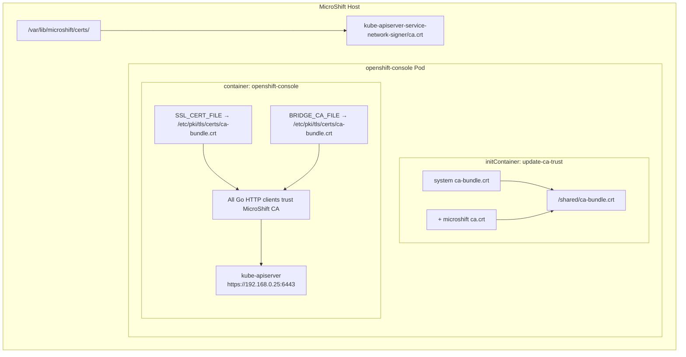
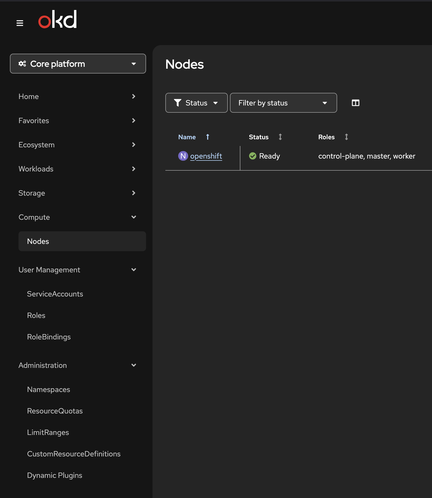

# 🍓 OpenShift Console on MicroShift — Raspberry Pi 4 (ARM64 / aarch64)

A complete guide to deploying the OpenShift Web Console on MicroShift, running on a Raspberry Pi 4 (8GB) with a USB SSD, starting from a Fedora 43 base image.


---

## 🤔 Why MicroShift? Why on a Raspberry Pi?

### The IoT/Edge context

The world of **IoT (Internet of Things)** and **Edge Computing** is evolving rapidly. More and more use cases require running container workloads **as close to the data source as possible** — on factory floors, in retail stores, in hospitals, or at home — rather than sending everything to the cloud.

**MicroShift** is Red Hat's answer to this challenge: a **lightweight, single-node OpenShift/Kubernetes distribution** designed specifically for:

- 🏭 **Edge devices** with limited resources (RAM, CPU, storage)
- 🔌 **Disconnected or low-bandwidth environments**
- 🤖 **IoT gateways** that need to run containerized workloads
- 🏠 **Homelab / development environments** to learn OpenShift without a full cluster

### Why a Raspberry Pi 4?

The **Raspberry Pi 4 (8GB)** is a perfect edge device candidate:

| Feature | Value |
|---|---|
| Architecture | ARM64 (aarch64) |
| RAM | 8GB |
| Storage | USB SSD (fast I/O, reliable) |
| Power consumption | ~5W |
| Cost | ~80€ |

It's an ideal platform to **learn, prototype, and simulate real edge/IoT deployments** at home.

### Why Fedora 43 instead of RHEL/CentOS?

Red Hat's official MicroShift documentation targets RHEL. However, using **Fedora 43** gives more flexibility:

- ✅ Free, no subscription required
- ✅ Latest kernel with good ARM64 support
- ✅ Access to the full Fedora/RPMFusion package ecosystem
- ✅ Closer to upstream, great for learning and experimentation
- ⚠️ Not officially supported by Red Hat for production use

---

## 🛠️ Hardware Setup

- **Board:** Raspberry Pi 4 Model B — 8GB RAM
- **Boot:** SD card
- **Storage** USB SSD
- **Network:** Static IP `192.168.0.25`

---


## Prerequisites

- A valid Red Hat pull secret (`~/.pull-secret.json`)

---

## 1. Install Fedora 43 on Raspberry Pi 4

We use a **pre-built Fedora 43 image from RPMFusion**, which includes proper ARM64/Raspberry Pi support out of the box.

### Download the pre-built image

👉 [https://rpmfusion.org/Howto/RaspberryPi#Pre-built_images_.28f43.29](https://rpmfusion.org/Howto/RaspberryPi#Pre-built_images_.28f43.29)

### Flash the image to your SD card

```bash
# On your workstation (Linux/macOS)

sudo dd if=Fedora-43-*.aarch64.raw.xz of=/dev/sdX bs=4M status=progress
sync
```

> 💡 You can also use [Raspberry Pi Imager](https://www.raspberrypi.com/software/) or [Balena Etcher](https://etcher.balena.io/) for a graphical experience.

Boot the Raspberry Pi from the SD card and complete the initial setup.

---

## 2. Resize the filesystem

After first boot, the filesystem only uses the image size. Resize it to use the full SD card capacity:

```bash
# Resize the partition
sudo growpart -u on /dev/mmcblk0 2

# Resize the btrfs filesystem to use all available space
sudo btrfs filesystem resize max /
```

---

## 3. Update the system

```bash
sudo dnf update -y
sudo reboot
```

---

## 4. Prepare the SSD for OpenShift storage

MicroShift uses **TopoLVM** for persistent storage. We create a dedicated **LVM Volume Group** on the SSD for container storage.

> ⚠️ This will **wipe all data** on `/dev/sda`. Make sure it is the correct device.

```bash
# Check your devices
lsblk

# Wipe existing signatures
wipefs -a /dev/sda

# Create Physical Volume
pvcreate -f /dev/sda

# Create Volume Group named 'openshiftdata1'
vgcreate openshiftdata1 /dev/sda

# Activate the Volume Group
vgchange -ay openshiftdata1
```

Verify:
```bash
vgs
# Should show: openshiftdata1
```

---

## 5. Prepare MicroShift installation

### Install required packages

```bash
sudo dnf install -y cri-o conntrack
```

- **cri-o**: The container runtime used by MicroShift/OpenShift
- **conntrack**: Required for Kubernetes networking (tracks network connections)

### Enable cgroups v2 (required for container resource management)

Edit the kernel boot parameters:

```bash
sudo nano /boot/efi/cmdline.txt
```

Add the following parameters at the end of the existing line:

```
cgroup_enable=cpuset cgroup_memory=1 cgroup_enable=memory
```

> 💡 **Why cgroups?** Kubernetes uses cgroups (Control Groups) to limit and isolate
> CPU, memory, and I/O resources for each container. Without these parameters,
> MicroShift cannot enforce resource limits.

```bash
# Reboot to apply the new kernel parameters
sudo reboot

# Verify cgroups are enabled after reboot
cat /proc/cmdline | grep cgroup
```

---

## 6. Install MicroShift

```bash
curl -s https://microshift-io.github.io/microshift/quickrpm.sh | sudo bash
```

This script:
- Adds the MicroShift RPM repository
- Installs MicroShift and its dependencies
- Installs the `oc` CLI tool

---

## 7. Configure MicroShift

Create the MicroShift configuration file:

```bash
sudo mkdir -p /etc/microshift
sudo nano /etc/microshift/config.yaml
```

```yaml
apiServer:
  advertiseAddress: 192.168.0.25       # IP address of your Raspberry Pi
  subjectAltNames: [openshift.genhome.com]  # DNS name for the API server certificate

dns:
  baseDomain: genhome.com              # Base domain for your cluster

network:
  clusterNetwork:
    - 10.42.0.0/16                     # Pod network CIDR
  serviceNetwork:
    - 10.43.0.0/16                     # Service network CIDR

node:
  hostnameOverride: "openshift"        # Node hostname

storage:
  driver: "topolvm"                    # Use TopoLVM for persistent storage
  topolvm:
    device-classes:
      - name: "default"
        volume-group: "openshiftdata1" # LVM Volume Group created earlier
        default: true
```

### Configuration explained

| Parameter | Description |
|---|---|
| `apiServer.advertiseAddress` | The IP address that the kube-apiserver will advertise to clients. Must be your Pi's IP. |
| `apiServer.subjectAltNames` | Additional DNS names added to the API server TLS certificate (for custom DNS access). |
| `dns.baseDomain` | The base DNS domain for all services in the cluster (e.g., `myapp.genhome.com`). |
| `network.clusterNetwork` | The IP range used for **Pod** IP addresses inside the cluster. |
| `network.serviceNetwork` | The IP range used for **Service** (ClusterIP) virtual addresses. |
| `node.hostnameOverride` | Forces the node to register with this name instead of the system hostname. |
| `storage.driver` | Storage driver — `topolvm` uses LVM for dynamic persistent volume provisioning. |
| `storage.topolvm.device-classes` | Defines which LVM Volume Group TopoLVM uses for storage. |

### Remove the default loopback storage configuration

By default, MicroShift may create a loopback-based Volume Group for storage. Since we have a real LVM VG, we remove this:

```bash
# Remove the default loopback storage service override
sudo rm -f /etc/systemd/system/microshift.service.d/10-lvms.conf

# Reload systemd
sudo systemctl daemon-reload
```

> ℹ️ The file `10-lvms.conf` configures a `losetup`-based (loopback device) Volume Group.
> This is fine for testing but wastes resources when you have a real SSD.

## 8. Start MicroShift

```bash
sudo systemctl enable --now microshift
```

Wait a few minutes for MicroShift to initialize, then check the node status:

```bash
# Copy the kubeconfig
mkdir -p ~/.kube
sudo cp /var/lib/microshift/resources/kubeadmin/kubeconfig ~/.kube/config
sudo chown $USER ~/.kube/config

# Check node status
oc get node
```

Expected output:
```
NAME        STATUS   ROLES                         AGE   VERSION
openshift   Ready    control-plane,master,worker   3m    v1.34.2
```

> ✅ When the node shows `Ready`, your MicroShift cluster is operational!

Check all system pods are running:
```bash
oc get pods -A
```

---

## 9. Find the correct console image for ARM64


### ⚠️ The problem with ARM64

The standard OpenShift release image `quay.io/openshift-release-dev/ocp-release:4.x.x-aarch64` is the **release index image** — it is **NOT** the console image itself. You must extract the exact console image reference from it.

### Step 1 — Find a valid ARM64 nightly build

Visit [https://arm64.ocp.releases.ci.openshift.org/](https://arm64.ocp.releases.ci.openshift.org/) and grab the latest accepted nightly tag.

### Step 2 — Extract the console image digest

```bash
# Get the exact console image digest for aarch64
oc adm release info \
  --registry-config=~/.pull-secret.json \
  quay.io/openshift-release-dev/ocp-release:4.21.6-aarch64 \
  --image-for=console
```

This will output something like:

```
quay.io/openshift-release-dev/ocp-v4.0-art-dev@sha256:abcdef1234...
```

> ✅ **Use this digest** in your deployment YAML — not the release index image.

---

## 2. Create namespace and service account

```bash
# Create namespace
oc create namespace openshift-console

# Create service account
oc create serviceaccount openshift-console -n openshift-console
```

### Create a non-expiring token secret

```bash
cat <<EOF | oc apply -f -
apiVersion: v1
kind: Secret
metadata:
  name: openshift-console-token
  namespace: openshift-console
  annotations:
    kubernetes.io/service-account.name: openshift-console
type: kubernetes.io/service-account-token
EOF
```

### Create RBAC permissions for the service account

```bash
cat <<EOF | oc apply -f -
apiVersion: rbac.authorization.k8s.io/v1
kind: ClusterRoleBinding
metadata:
  name: openshift-console
roleRef:
  apiGroup: rbac.authorization.k8s.io
  kind: ClusterRole
  name: cluster-admin
subjects:
- kind: ServiceAccount
  name: openshift-console
  namespace: openshift-console
EOF
```

---

## 3. Handle the pull secret on MicroShift

Since the console image is on `quay.io/openshift-release-dev` (requires authentication), you need to make the pull secret available.

### Option 1 — Global pull secret (recommended)

```bash
sudo cp ~/.pull-secret.json /etc/crio/openshift-pull-secret
sudo chmod 600 /etc/crio/openshift-pull-secret
```

### Option 2 — Kubernetes imagePullSecret

```bash
oc create secret generic pull-secret \
  -n openshift-console \
  --from-file=.dockerconfigjson=~/.pull-secret.json \
  --type=kubernetes.io/dockerconfigjson

# Patch the service account to use it
oc secrets link default pull-secret --for=pull -n openshift-console
```

---

## 4. Find the correct CA certificate

MicroShift has multiple CA certificates. You need to find the one that actually signs the kube-apiserver certificate for your external IP.

### Step 1 — Identify which CA signs the kube-apiserver certificate

```bash
echo | openssl s_client -connect 192.168.0.25:6443 2>/dev/null \
  | openssl x509 -noout -subject -issuer
```

Expected output:
```
subject=CN=10.43.0.1
issuer=CN=kube-apiserver-service-network-signer
```

### Step 2 — Test all available CA certificates automatically

> ⚠️ Do **NOT** use `curl -k` — the `-k` flag skips ALL certificate verification and always returns OK.
> Use `--cacert` without `-k` instead:

```bash
for cert in $(sudo find /var/lib/microshift/certs/ -name "ca.crt"); do
  result=$(sudo curl -s --cacert $cert \
    https://192.168.0.25:6443/healthz 2>&1)
  echo "$cert → $result"
done
```

Example output:
```
/var/lib/microshift/certs/kube-control-plane-signer/ca.crt →
/var/lib/microshift/certs/kube-apiserver-to-kubelet-client-signer/ca.crt →
/var/lib/microshift/certs/admin-kubeconfig-signer/ca.crt →
/var/lib/microshift/certs/kube-apiserver-external-signer/ca.crt →
/var/lib/microshift/certs/kube-apiserver-localhost-signer/ca.crt →
/var/lib/microshift/certs/kube-apiserver-service-network-signer/ca.crt → ok  ✅
/var/lib/microshift/certs/etcd-signer/ca.crt →
```

✅ The correct certificate is:
```
/var/lib/microshift/certs/kube-apiserver-service-network-signer/ca.crt
```

### Step 3 — Confirm with openssl verify

```bash
openssl verify \
  -CAfile /var/lib/microshift/certs/kube-apiserver-service-network-signer/ca.crt \
  <(echo | openssl s_client -connect 192.168.0.25:6443 2>/dev/null | openssl x509)
```

Expected output: `stdin: OK`

---

## 5. Create the ConfigMap with the CA

```bash
oc create configmap microshift-ca \
  --from-file=ca.crt=/var/lib/microshift/certs/kube-apiserver-service-network-signer/ca.crt \
  -n openshift-console
```

Verify the ConfigMap content:
```bash
oc get configmap microshift-ca -n openshift-console \
  -o jsonpath='{.data.ca\.crt}' | openssl x509 -noout -subject -issuer
```

Expected output:
```
subject=CN=kube-apiserver-service-network-signer
issuer=CN=kube-apiserver-service-network-signer
```

---

## 6. Deploy the console

See the [Full deployment YAML](#9-full-deployment-yaml) section below.

---

## 7. TLS issues and solutions

This is the most complex part of the deployment. Several TLS errors were encountered and required specific solutions.

---

### ❌ Error 1 — `x509: certificate signed by unknown authority` on `selfsubjectreviews`

```
Failed to get user data to handle user setting request:
Post "https://192.168.0.25:6443/apis/authentication.k8s.io/v1/selfsubjectreviews":
tls: failed to verify certificate: x509: certificate signed by unknown authority
```

**Root cause:**

The console has **two separate HTTP clients** in Go:
- The main proxy → uses `BRIDGE_CA_FILE` ✅
- The internal `handlers.go` client → uses the **system CA store** of the container ❌

Setting `BRIDGE_CA_FILE` alone is not enough. The `handlers.go` client ignores it and uses the system CA pool (`/etc/pki/tls/certs/ca-bundle.crt` inside the container).

**Solution — Inject the CA into the system store using an initContainer:**

```bash
# Check the system CA store location inside the container
oc exec -it <pod-name> -n openshift-console -- ls /etc/pki/tls/certs/
# ca-bundle.crt  ca-bundle.trust.crt
```

The initContainer merges the system CA bundle with the MicroShift CA:

```yaml
initContainers:
  - name: update-ca-trust
    image: quay.io/openshift-release-dev/ocp-v4.0-art-dev@sha256:<DIGEST>
    command:
      - /bin/bash
      - -c
      - |
        cat /etc/pki/tls/certs/ca-bundle.crt /tmp/microshift-ca/ca.crt > /shared/ca-bundle.crt
    volumeMounts:
      - name: ca-cert
        mountPath: /tmp/microshift-ca
        readOnly: true
      - name: shared-ca
        mountPath: /shared
```

Then in the main container, mount the enriched bundle and set `SSL_CERT_FILE`:

```yaml
env:
  - name: BRIDGE_CA_FILE
    value: /etc/pki/tls/certs/ca-bundle.crt
  - name: SSL_CERT_FILE                    # ← Go uses this for ALL HTTP clients
    value: /etc/pki/tls/certs/ca-bundle.crt
volumeMounts:
  - name: shared-ca
    mountPath: /etc/pki/tls/certs          # ← overrides system CA store
```

> 💡 **Why `SSL_CERT_FILE`?**
> Go respects the `SSL_CERT_FILE` environment variable natively for **all** HTTP clients,
> including the internal one in `handlers.go`. This ensures every TLS connection
> in the process uses your CA.

---

### ❌ Error 2 — `http: proxy error: tls: failed to verify certificate`

```
http: proxy error: tls: failed to verify certificate:
x509: certificate signed by unknown authority
```

**Root cause:** Same as Error 1 — the proxy path also uses the system CA store.

**Solution:** Same fix — inject the CA into the system store via initContainer + `SSL_CERT_FILE`.

---

### ❌ Error 3 — `namespace "openshift-console-user-settings" not found`

```
Failed to create user settings: namespaces "openshift-console-user-settings" not found
```

**Root cause:** In a full OpenShift cluster, this namespace is created automatically by the console operator. In MicroShift, no operator runs → the namespace never gets created.

**Solution:**

```bash
oc create namespace openshift-console-user-settings
```

---

## 8. Create the user-settings namespace

```bash
oc create namespace openshift-console-user-settings
```

After this, the console will automatically create ConfigMaps in this namespace to store user preferences. You should see in the logs:

```
User settings ConfigMap "user-settings-xxxx" already exist, will return existing data.
```

This is **normal and expected** ✅

---

## 9. Full deployment YAML

```yaml
---
apiVersion: apps/v1
kind: Deployment
metadata:
  name: openshift-console-deployment
  namespace: openshift-console
spec:
  replicas: 1
  selector:
    matchLabels:
      app: openshift-console
  template:
    metadata:
      labels:
        app: openshift-console
    spec:
      # ─── initContainer: merge system CA bundle with MicroShift CA ───────────
      initContainers:
        - name: update-ca-trust
          # Use the same image as the console container
          image: quay.io/openshift-release-dev/ocp-v4.0-art-dev@sha256:<DIGEST_FROM_STEP_1>
          command:
            - /bin/bash
            - -c
            - |
              cat /etc/pki/tls/certs/ca-bundle.crt /tmp/microshift-ca/ca.crt \
                > /shared/ca-bundle.crt
          volumeMounts:
            - name: ca-cert
              mountPath: /tmp/microshift-ca
              readOnly: true
            - name: shared-ca
              mountPath: /shared

      # ─── Main console container ──────────────────────────────────────────────
      containers:
        - name: openshift-console
          # ✅ Use the digest from: oc adm release info --image-for=console
          image: quay.io/openshift-release-dev/ocp-v4.0-art-dev@sha256:<DIGEST_FROM_STEP_1>
          ports:
            - containerPort: 9000
          env:
            # Disable user authentication (no OAuth in MicroShift)
            - name: BRIDGE_USER_AUTH
              value: disabled

            # Off-cluster mode to reach MicroShift kube-apiserver
            - name: BRIDGE_K8S_MODE
              value: off-cluster
            - name: BRIDGE_K8S_MODE_OFF_CLUSTER_ENDPOINT
              value: https://192.168.0.25:6443

            # TLS verification — set to false, CA is injected via SSL_CERT_FILE
            - name: BRIDGE_K8S_MODE_OFF_CLUSTER_SKIP_VERIFY_TLS
              value: "false"

            # Bearer token authentication
            - name: BRIDGE_K8S_AUTH
              value: bearer-token
            - name: BRIDGE_K8S_AUTH_BEARER_TOKEN
              valueFrom:
                secretKeyRef:
                  name: openshift-console-token
                  key: token

            # CA file for the main proxy
            - name: BRIDGE_CA_FILE
              value: /etc/pki/tls/certs/ca-bundle.crt

            # ✅ Critical: Go uses SSL_CERT_FILE for ALL HTTP clients
            # This fixes the handlers.go TLS error
            - name: SSL_CERT_FILE
              value: /etc/pki/tls/certs/ca-bundle.crt

          volumeMounts:
            # Mount the enriched CA bundle (system + MicroShift) from initContainer
            - name: shared-ca
              mountPath: /etc/pki/tls/certs
            # Also mount the raw MicroShift CA for reference
            - name: ca-cert
              mountPath: /etc/ssl/microshift
              readOnly: true

      # ─── Volumes ─────────────────────────────────────────────────────────────
      volumes:
        # ConfigMap containing the MicroShift CA certificate
        - name: ca-cert
          configMap:
            name: microshift-ca
        # Shared volume between initContainer and main container
        - name: shared-ca
          emptyDir: {}

---
apiVersion: v1
kind: Service
metadata:
  name: openshift-console
  namespace: openshift-console
spec:
  selector:
    app: openshift-console
  ports:
    - protocol: TCP
      port: 9000
      targetPort: 9000
  type: LoadBalancer
```

---

## 🗺️ Architecture Overview




---

## ✅ Verification

After deployment, check the logs:

```bash
oc logs -f deployment/openshift-console-deployment -n openshift-console
```

**Healthy logs look like:**
```
CheckOrigin: Proxy has no configured Origin. Allowing origin [http://192.168.0.25:9000]
User settings ConfigMap "user-settings-xxxx" already exist, will return existing data.
```

**No more errors like:**
```
❌ x509: certificate signed by unknown authority
❌ http: proxy error: tls: failed to verify certificate
❌ namespaces "openshift-console-user-settings" not found
```

---

## 🔗 Access the console

```
http://192.168.0.25:9000
```



---

## 🚀 Next Steps

### 🔐 Secure Access with Teleport

To secure access to your Raspberry Pi and MicroShift cluster, you can install **Teleport**.

Teleport provides:
- Secure SSH access (certificate-based)
- Kubernetes access control
- Web UI for infrastructure access
- Audit logging of all sessions

This is especially useful for:
- Edge environments
- Remote access to your cluster
- Centralized authentication

---

### 🚀 Install ArgoCD (GitOps)

Once MicroShift and the OpenShift Console are up and running, the next step is to enable **GitOps workflows** by installing ArgoCD.

ArgoCD allows you to:
- Deploy applications declaratively from Git
- Continuously sync your cluster state
- Manage workloads using a GitOps approach

---

## 📚 References

- [MicroShift Documentation](https://microshift.io)
- [OpenShift Console GitHub](https://github.com/openshift/console)
- [ARM64 OCP Nightly Builds](https://arm64.ocp.releases.ci.openshift.org/)